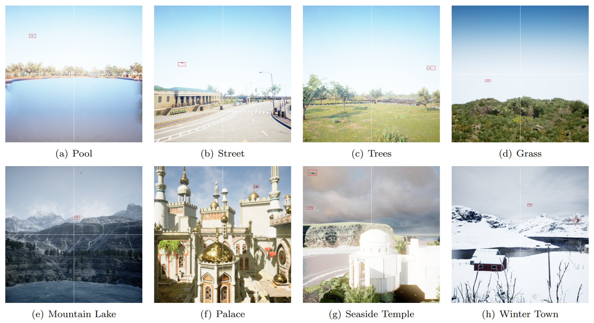
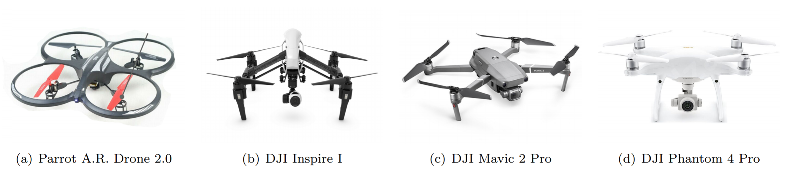
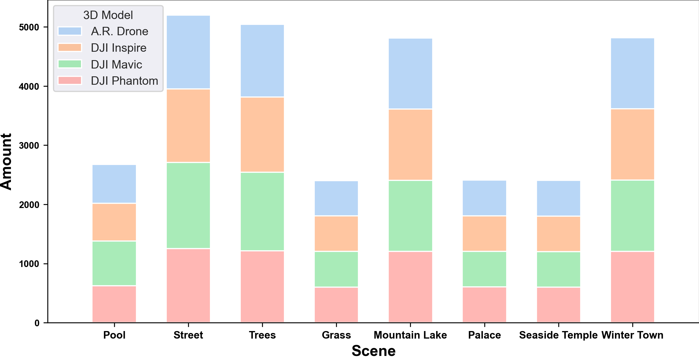
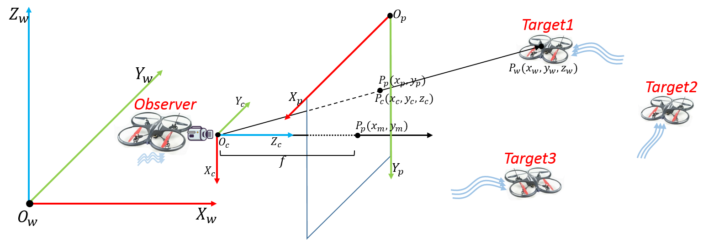

### Dataset Overview
​	SimUAV is a simulated, not real-world, dataset for UAV small object detection. It contains **29,568** images in **8** scenes or backgrounds including street, trees, grass, mountain lake, palace, winter town, and temple. Each scene has **4** multi-rotor models: Parrot A.R. Drone 2.0, DJI Inspire I, DJI Mavic 2 Pro, and Dji Phantom 4 Pro. 

<b>Figure 1</b> Examples for 8 scenes simulated, each has been annotated by red boxes. Note the white cross-line in each image helps to locate the objects(in which quadrant) and the multi-rotor model in each image is DJI Mavic 2 Pro.

<b>Figure 2</b> 3D models for multi-rotors we used in simulation.

|      COUNT      | Pool | Street | Trees | Grass | Mountain Lake | Palace | Seaside Temple | Winter Town |
| :-------------: | :--: | :----: | :---: | :---: | :-----------: | :----: | :------------: | :---------: |
| **A.R. Drone**  | 653  |  1248  | 1230  |  600  |     1203      |  602   |      604       |    1201     |
| **DJI Inspire** | 641  |  1240  | 1274  |  600  |     1202      |  603   |      601       |    1206     |
|  **DJI Mavic**  | 757  |  1460  | 1326  |  601  |     1204      |  600   |      602       |    1205     |
| **DJI Phantom** | 623  |  1251  | 1216  |  603  |     1204      |  604   |      600       |    1204     |

<b>Table 1</b> Image Count of each model and scene.

<b>Figure 3</b> Proportion of each scene and model.

### How to Get

Anyone can get access the SimUAV Dataset by following links:

- Pool(1.01GB): [Google Drive](https://drive.google.com/file/d/1DhNubHELtf2ghw9RT7oETCOreb1Hpcgi/view?usp=sharing); 	[Baidu Cloud](https://pan.baidu.com/s/1xVVMRNZRRdEXifHRkNNgog) Token: 711K
- Street(2.3GB): [Google Drive](https://drive.google.com/file/d/1DhNubHELtf2ghw9RT7oETCOreb1Hpcgi/view?usp=sharing); 	[Baidu Cloud](https://pan.baidu.com/s/1xVVMRNZRRdEXifHRkNNgog) Token: 711K
- Trees(2.41GB): [Google Drive](https://drive.google.com/file/d/1DhNubHELtf2ghw9RT7oETCOreb1Hpcgi/view?usp=sharing); 	[Baidu Cloud](https://pan.baidu.com/s/1xVVMRNZRRdEXifHRkNNgog) Token: 711K
- Grass(872MB): [Google Drive](https://drive.google.com/file/d/1DhNubHELtf2ghw9RT7oETCOreb1Hpcgi/view?usp=sharing); 	[Baidu Cloud](https://pan.baidu.com/s/1xVVMRNZRRdEXifHRkNNgog) Token: 711K
- Mountain Lake(2.44GB): [Google Drive](https://drive.google.com/file/d/1DhNubHELtf2ghw9RT7oETCOreb1Hpcgi/view?usp=sharing); 	[Baidu Cloud](https://pan.baidu.com/s/1xVVMRNZRRdEXifHRkNNgog) Token: 711K
- Palace(1.6GB): [Google Drive](https://drive.google.com/file/d/1DhNubHELtf2ghw9RT7oETCOreb1Hpcgi/view?usp=sharing); 	[Baidu Cloud](https://pan.baidu.com/s/1xVVMRNZRRdEXifHRkNNgog) Token: 711K
- Seaside Temple(1.08GB): [Google Drive](https://drive.google.com/file/d/1DhNubHELtf2ghw9RT7oETCOreb1Hpcgi/view?usp=sharing); 	[Baidu Cloud](https://pan.baidu.com/s/1xVVMRNZRRdEXifHRkNNgog) Token: 711K
- Winter Town(2.9GB): [Google Drive](https://drive.google.com/file/d/1DhNubHELtf2ghw9RT7oETCOreb1Hpcgi/view?usp=sharing); 	[Baidu Cloud](https://pan.baidu.com/s/1xVVMRNZRRdEXifHRkNNgog) Token: 711K

**Warm prompt:** before you download any scene you choose, it may help to preview the example images in the 'examples' fold..

### Background

​	In recent years, UAVs(Unmanned Aerial Vehicles, here we mean multi-rotors) have been widely used in agriculture, industry, and the military, bringing great risks to public security such as illegal flying, spy flying, and more seriously， terrorist attack by dropping bombs. Therefore, research on the detection and recognition of UAV targets has already been carried out. Popular technologies for UAV small object detection mainly resort to deep learning algorithms in computer vision, which always need a large number of data. Unfortunately, few object detection datasets are available on multi-rotors. To address (relieve) this issue, we construct the SimUAV dataset which is entirely generated by simulation softwares without any real-world image.

### Task Description
​	We definite the task of **UAV small object detection**: determine whether there are any instances of UAV, specifically multi-rotors in an image and, if present, to return the spatial location and extent of each object instance (e.g., via a bounding box). Small here means the ground-truth box size of each object is always small, exactly no larger than **30\*30 pixels** in a 640\*640 image. 

### Simulation Platform
​	We apply Airsim and UE4 as our simulation softwares. [Airsim](https://microsoft.github.io/AirSim/) is an open-source simulator for drones, built on Epic Games’ [Unreal Engine 4](https://www.unrealengine.com/) as a platform for AI research. Airsim allows us to fly multi-rotors in UE4 rendering environments at various velocities and on expected paths which can be set easily by python API. Besides, Airsim supports substituting any 3D model file for the default multi-rotor model. UE4 provides a variety of environments or scenes in Epic Store, including forests, beaches, cities, parks, and so on.

    
    

<b>Figure 3 Left</b>: A snapshot from AirSim shows a multi-rotor flying in an urban environment. <b>Right</b>: A Search Page of UE 4 Market.

### Simulation Method

​	The generation of the SimUAV dataset is implemented by Airsim Python API. As described in figure 5, we create four multi-rotors, one as the observer which carries several cameras(we only depict one camera) and others as the targets flying at a certain distance from the observer. Targets are expected to be captured by one or more cameras, and consequently, the camera image will be stored. Note that, we keep the observer vibrate during simulation in order to imitate shooting by human hand.

<b>Figure 5</b> The observer multi-rotor shoot the target multi-rotors with onboard cameras.

​	Since the positions of targets and attitudes of cameras are available by Airsim during shooting, the labels of each image can be computed theoretically. Taking Target1 in figure 5 as an example, there are three frames involved: world frame, camera frame, and pixel frame, respectively expressed by $O_wX_wY_wZ_w$, $O_cX_cY_cZ_c$, and $O_pX_pY_p$. Therefore, we express the position of Target1 in three frames as $P_w(x_w,y_w,z_w)$, $P_c(x_c,y_c,z_c)$, and $P_p(x_p, y_p)$ respectively. Obviously, $P_p(x_p, y_p)$ is what we need in annotation and can be computed by the following formulas (1) and (2):
$$
\left[
 \begin{matrix}
   x_c\\
   y_c\\
   z_c
  \end{matrix}
  \right] = R\left[
 \begin{matrix}
   x_w\\
   y_w\\
   z_w
  \end{matrix}
  \right] + t\tag{1}
$$
where $R\in \{R|R^TR=I_3, det(R)=1\}$ is the rotation matrix  with respect to the transformation from $O_wX_wY_wZ_w$ to $O_cX_cY_cZ_c$ and $t$ is the translation vector (equal to the camera position in the world frame) . Both $R$ and $t$ can be obtained by Airsim with a little computation;
$$
\begin{cases}
x_p = y_m - f\frac{y_c}{z_c}\\
y_p = x_m + f\frac{x_c}{z_c}
\end{cases}\tag{2}
$$
where $f$ is focal length set in Airsim, and$P_p(x_w, y_m)$ is the center position in pixel frame of the image, for example$P_p(x_w, y_m)$ is $P_m(320, 320)$ in a 640*640 image.

​	Overall, we generate all the annotated images in various scenes and drone models forming the SimUAV dataset.

### Cite

